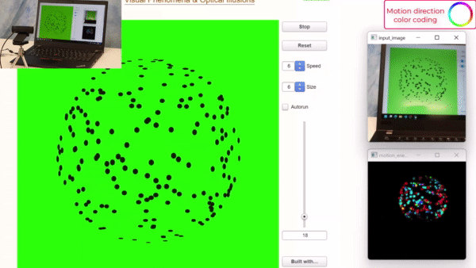
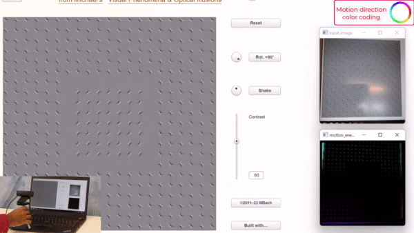

# Motion Perception Tool

An efficient, real-time implementation of Adelson's [spatiotemporal energy model](https://pubmed.ncbi.nlm.nih.gov/3973762/). A fun use case for this tool is to verify motion perception on a number of visual phenomena such as [“Stepping feet” Motion Illusion](https://michaelbach.de/ot/mot-feetLin/index.html), [Pinna-Brelstaff Illusion](https://michaelbach.de/ot/mot-PinnaBrelstaff/index.html), [“Spine drift” illusion](https://michaelbach.de/ot/mot-spineDrift/index.html) etc. This can be done by placing an external webcam in front of a display showing the illusions, and optionally moving the webcam to resemble eye movements.

An online version of this tool (with reduced functionality) is available at [https://oxidification.com/a/motion_perception_tool/](https://oxidification.com/a/motion_perception_tool/).

This code accompanies [this paper](https://journals.sagepub.com/doi/10.1177/20416695231159182):
```
Battaje, A., Brock, O., & Rolfs, M. (2023).
An interactive motion perception tool for kindergarteners (and vision scientists).
i-Perception, 14(2), 1–6.
https://doi.org/10.1177/20416695231159182
```

Work done at [Robotics and Biology Laboratory](https://www.robotics.tu-berlin.de/menue/home/), [Active Perception and Cognition (rolfslab)](https://rolfslab.org/), and [Science of Intelligence](https://www.scienceofintelligence.de/).

## Install

This package has the following dependencies

- Python (>=3.8)
- PyTorch (>=1.8)
- OpenCV-Python (>=4.1)

We recommend running this code in a virtual environment encapsulated within this folder. For this run,

```
python3 -m venv --prompt env_motion_energy env
```
This will create a folder `env/` with a virtual environment. Activate this environment using
```
# For Linux/Mac
source env/bin/activate

# For Windows (PowerShell)
.\env\bin\Activate.ps1

# For Windows (CMD)
.\env\bin\activate.bat
```

Once the environment is activated, install the required packages using `pip3`

```
pip3 install torch torchaudio torchvision opencv-python
```

## Run

Simply run the `motion_energy_split_kernel.py` script with a camera attached to your PC. You will see several visualization screens as shown below. 



Bottom-right window visualizes motion energy. The colors here indicate motion direction. The colors are encoded as shown in the color wheel on top-right.

You may also move the camera, e.g., to simulate fixational (drift) eye movements. An example is shown below.



Additional options can be specified to `motion_energy_split_kernel.py` to change its behavior. The available options and its usage are provided below:
```
$ python motion_energy_split_kernel.py --help
usage: motion_energy_split_kernel.py [-h] [-f FILE] [-c CAM_ID] [-x] [-e] [-a] [-v]

Visualize spatiotemporal energy model on webcam feed or video file

optional arguments:
  -h, --help            show this help message and exit
  -f FILE, --file FILE  video filename as input; if not specified, defaults to a camera device
  -c CAM_ID, --cam-id CAM_ID
                        camera ID as input; typically 0 is internal webcam, 1 is external camera (default: 0); NOTE ignored if --file is specified
  -x, --disable-scale   disables video input scaling, else scales input to 240x240
  -e, --ensure-contiguous
                        makes sure spatiotemporal volume contains continuously sampled images from the camera input. This is most useful if it is taking too long to produce an iteration of
                        visualization (very choppy appearance). NOTE ineffective if --file is specified
  -a, --accelerate-with-cuda
                        tries to accelerate compute with NVIDIA CUDA instead of running on CPU. If your computer does not have a supporting GPU, CPU will be used as a fallback.
  -v, --verbose         print extra information on the command line
```

To exit the program, press ESC key.

### Change parameters of spatiotemporal energy model

You can also change the spatial or temporal aspects of the model. Such parameters are found in the constructor of class `MotionEnergy`. For example, you may specify additional spatial kernels with different orientations at [L123](motion_energy_split_kernel.py#L123).
